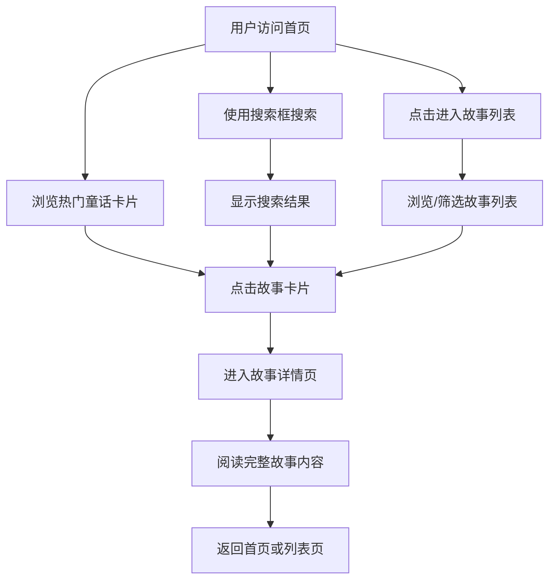

## 1. 产品概述
童话图书馆是一个收集世界各地经典童话故事的在线阅读平台，为儿童和成人提供梦幻绘本风格的阅读体验。
- 主要目标：打造一个沉浸式的童话世界，让用户可以便捷地浏览、搜索和阅读经典童话故事
- 目标用户：喜欢童话故事的儿童（需家长陪同）和成年人
- 市场价值：满足人们对优质童话内容的需求，提供温馨、治愈的阅读体验

## 2. 核心功能

### 2.1 功能模块
1. **首页**：顶部导航、搜索框、热门童话卡片展示、书架布局
2. **故事列表页**：故事分类筛选、搜索结果、童话卡片网格
3. **故事详情页**：故事封面、故事信息、完整故事内容、翻页阅读效果

### 2.2 页面详情
| 页面名称 | 模块名称 | 功能描述 |
|-----------|-------------|---------------------|
| 首页 | 顶部导航 | Logo、首页/故事列表链接、搜索入口 |
| 首页 | 搜索框 | 关键词搜索童话故事 |
| 首页 | 热门童话区 | 展示精选热门故事卡片 |
| 首页 | 书架展示区 | 以书架形式展示多本童话书籍 |
| 故事列表页 | 分类筛选 | 按地区/类型筛选故事 |
| 故事列表页 | 故事网格 | 卡片式展示所有童话书籍 |
| 故事详情页 | 故事封面区 | 大图展示书籍封面 |
| 故事详情页 | 故事信息 | 标题、作者、地区、标签 |
| 故事详情页 | 故事内容 | 分页展示完整故事正文，支持翻页阅读 |

## 3. 核心流程
用户进入首页 → 浏览热门故事或使用搜索 → 点击故事卡片进入详情页 → 阅读完整故事内容 → 可返回首页或列表继续浏览其他故事

## 4. 用户界面设计

### 4.1 设计风格
- **主色调**：梦幻粉紫渐变（#D4A5FF ~ #FFD4E5）、奶白色背景（#FFF8F0）
- **辅助色**：天空蓝（#A5D8FF）、薄荷绿（#B5EAD7）、金色点缀（#FFD700）
- **按钮风格**：圆润、带柔和阴影、悬浮时有上浮效果
- **字体**：标题使用手写风格装饰字体，正文使用圆润易读的无衬线字体
- **布局风格**：卡片式布局，书架展示，大量圆角和柔和阴影
- **装饰元素**：星星、云朵、魔法棒、小精灵等童话元素装饰

### 4.2 页面设计概览
| 页面名称 | 模块名称 | UI元素 |
|-----------|-------------|-------------|
| 首页 | 顶部导航 | 梦幻渐变背景、Logo带星光效果、导航链接悬浮变色 |
| 首页 | 搜索框 | 圆角造型、魔法棒图标、悬浮发光效果 |
| 首页 | 热门童话区 | 卡片3D倾斜效果、悬浮放大、封面插画 |
| 首页 | 书架展示区 | 木质书架纹理、书籍立放效果、翻页动画 |
| 故事列表页 | 分类筛选 | 童话风格标签按钮、选中状态高亮 |
| 故事列表页 | 故事网格 | 等距卡片网格、悬浮光影效果 |
| 故事详情页 | 故事封面区 | 大幅封面展示、渐变边框、装饰元素 |
| 故事详情页 | 故事内容 | 羊皮纸风格背景、首字母装饰、翻页过渡动画 |

### 4.3 响应式设计
- 桌面端优先设计（1280px及以上）
- 平板端（768px ~ 1024px）：调整卡片数量和间距
- 移动端（375px ~ 767px）：单列布局，简化导航，优化触摸区域
