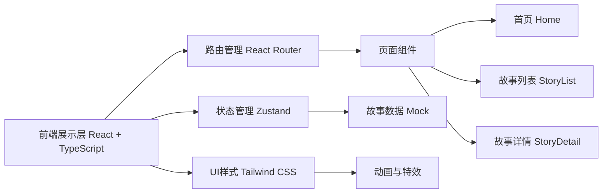

## 1. 架构设计



## 2. 技术选型说明
- **前端**：React@18 + TypeScript + Vite
- **初始化工具**：vite-init
- **路由**：react-router-dom
- **状态管理**：zustand
- **样式框架**：tailwindcss@3
- **图标库**：lucide-react
- **后端**：无（使用Mock数据）
- **数据库**：无（使用本地Mock数据）

## 3. 路由定义
| 路由 | 用途 |
|-------|---------|
| / | 首页 - 书架展示、热门童话、搜索 |
| /stories | 故事列表页 - 分类筛选、故事卡片网格 |
| /stories/:id | 故事详情页 - 故事内容阅读 |

## 4. 数据模型

### 4.1 故事数据类型定义
```typescript
interface Story {
  id: string;
  title: string;
  author: string;
  region: string;
  tags: string[];
  coverImage: string;
  summary: string;
  content: string[];
  isHot?: boolean;
  createdAt: string;
}
```

### 4.2 Mock数据
包含至少10个经典童话故事，涵盖：
- 安徒生童话（丹麦）：丑小鸭、卖火柴的小女孩、海的女儿
- 格林童话（德国）：白雪公主、灰姑娘、小红帽
- 中国童话：田螺姑娘、牛郎织女
- 其他地区：一千零一夜（阿拉伯）、伊索寓言（古希腊）
